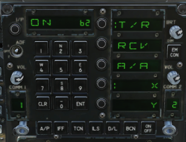

# Winwing Universal UFC Addon

### **Contact Information**
- Email: preston.meade1@gmail.com
- Discord: jerold#7539
- DCS Forums: prestonflying

### About this project
Hi! This is my attempt at getting the **Winwing F18 UFC** to work with other DCS Modules. The goal was to create a simple, easily expandable way of sending DCS module information to the **Winwing F18 UFC**.  The result is an updated Winwing lua folder that just needs to be copied into your Saved Games/DCS/Scripts folder. **See instructions below!** 

This does not limit any Winwing product functionallity and it 100% compatible. 

# Installation
#### This is easier than it seems, just added every step for all tech levels.
**TLDR**: Replace the `Scripts/wwt` folder with the downloaded  <a href="https://github.com/llamaXc/winwing-ufc-addon/releases/download/V1.0.1/wwt.zip" download>Latest Release wwt<a/>.

 1. Download the <a href="https://github.com/llamaXc/winwing-ufc-addon/releases/download/V1.0.1/wwt.zip" download>Latest Release<a/>
 2. Unzip the .zip file using 7-zip or some other compression program.
 3. You will have a folder titled `wwt`.
 4. Ensure SimApp Pro is running
	 - **Note**: SimApp Pro may overwrite `Scripts/wwt/wwtExport.lua`. If this happens, this add-on will need to be re-copied over. This may happen during a SimApp Pro update or clicking "Repair Lua" in SimApp Pro Settings. See Note on step 6 for a more permanent way to install.
 5. Make a copy of your `<USER>/Saved Games/<DCS>/Scripts/wwt` folder incase you ever want to undo these changes, I keep mine on my desktop just in case.
 6. Copy the `wwt` folder into `<USER>/Saved Games/<DCS>/Scripts/` and replace the existing `wwt` folder
    - **Note: More permanent  install (until SimApp Pro has a version update)**: Do step 5, then replace `C:\Program Files (x86)\SimAppPro\resources\app.asar.unpacked\Events\wwt` with the `wwt` folder from step 3 (the one you also copied in step 5. This makes it so every time SimApp Pro starts up, it will not overwrite your add-on). **Requires re-installtion after SimApp Pro does an update.
**
 7. Launch DCS
 8. Select a compatible module. 
	 - **AV88 Harrier**: Supports ODU and UFC replica of DCS
	 - **UH1 Huey**: Supports Radar Altimeter on scratch pad
	 - **A-10C2**: Supports static text on the option displays. FUNC, HACK, LTR, MK, ALT
	 - **MyCustomModuleExample**: Shows an example of adding a new module
9. Fly DCS and verify UFC is working.
10. If something does not look right, take a look at `<USER>/Saved Games/<DCS>/Logs/dcs.log` and look for any errors from the `WWT` log output. You can also file an [issue](https://github.com/llamaXc/winwing-ufc-addon/issues) if you are having problems.

## Disclaimer
This solution depends on the current state of **SimApp Pro** and how it manages the F18 UFC. This is not an ideal way of accomplishing this task, but with SimApp Pro being a compiled executable and not easily changeable, this is the was the simplest way I saw to get the UFC working with other modules.

## How does data get shown on the UFC?
When flying other modules, this addon will mimic the F18 messages to **SimApp Pro** containing the UFC payload but filled with our target data. In the event **SimApp Pro** changes how it reads UFC state from DCS< a change will be required in this add on. SimApp Pro thinks we are flying an F18, and this add-on sends the proper messages to get SimApp Pro to show our data on the real UFC Device.

## Known limitations
- The brightness is hard-coded to 80% for the LCD displays. I have not yet found a way to sync it easily across modules, so for now its always light.
- This is not a permeante feature, if Winwing changes SimApp Pro UFC logic, this would effect this add-on and require updates. If that happens I'll share a fix as soon as possible here.
- If anymore are discovered they will be added here.

## What is next to come?
- Perhaps showing Master Arm on/off state and controlling via UFC for other modules
- In F14 show selected weapon or remaining gun ammo
- Store count in Apache or airspeed/altitude/heading/vsi information
- Really anything you can think of can be added. These are just examples to give you some inspritation. If you really want one, leave an issue on this project and I can add it.

## Adding more modules
If you find this add on useful and want to see more features, leave an [issue](https://github.com/llamaXc/winwing-ufc-addon/issues) request on this project and myself or someone else can look into adding it.

For those wanting to make a [Pull Request](https://github.com/llamaXc/winwing-ufc-addon/pulls) and add features by yourself, you will want to start by brainstorming a few things before making your PR. 

 1. What module are you looking to update or add? 
	 - You will need to add a new file in in `wwt/ufcPatch/aircraft/ufcPatchMYMODULE.lua` that builds a proper generates a UFC message. **See aircraft/ufcPatchCustomModuleExample.lua for an example**.
	 - If adding a new aircraft, you must add a new `if statement` to `generateUFCExport` in `ufcPatch/ufcPatch.lua` that returns the new generated SimApp Pro payload data.
2. What data do you want to export?
	- Keep in mind, the UFC displays are LCD and only have so many segments, thus you are limited to the characters you can display.  Here is the supported data that can be shown on the UFC
	- Use the already provided DCS functions to get data from the game. See this [Export.lua](https://github.com/sprhawk/dcs_scripts/blob/master/Export.lua) for a good example of what data you can access.
	- This data table is an example of what data is shown on the UFC. Scenario is F18 UFC Tacan Menu

    

|Window Name| Description | Location |Compatible Data|F18 Example Data
|--|--|--|--|--|
|option1| UFC Display Window 1| Right hand side of UFC| Can show 4 characters. Digits or Capital Letters|:T/R **(ignore the : as that is coverd by `selectedWindows` argument)**
|option2| UFC Display Window 2| Right hand side of UFC| Can show 4 characters. Digits or Capital Letters| RCV
|option3| UFC Display Window 3| Right hand side of UFC|Can show 4 characters. Digits or Capital Letters| A/A
|option4| UFC Display Window 4| Right hand side of UFC|Can show 4 characters. Digits or Capital Letters| :X
|option5| UFC Display Window 5| Right hand side of UFC| Can show 4 characters. Digits or Capital Letters | Y
|scratchPadNumbers| UFC Scratch Pad Window | Scratch pad numerical display | Can show 4 digits. 0-9 | 62
|scratchPadString1| UFC Scratch Pad Letter Window 1| Most left charter on the scratch pad| Can show 0-9 or A-Z| O
|scratchPadString2| UFC Scratch Pad Letter Window 2| Most left charter on the scratch pad| Can show 0-9 or A-Z | N
|com1|UFC Com1 Display Window | Bottom Left of UFC | Can show 0-99 or A-Z. (Note due to LCD segments some numbers over 10 look malformed)| 1
|com2|UFC Com2 Display Window | Bottom Rightof UFC | Can show 0-99 or A-Z. (Note due to LCD segments some numbers over 10 look malformed)| 2
|selectedWindows| Along option 1 - 5 left side of the display |Along any option[1-5] window| Array of strings representing index's of windows to show a :. Example {"1","3"} | :X

